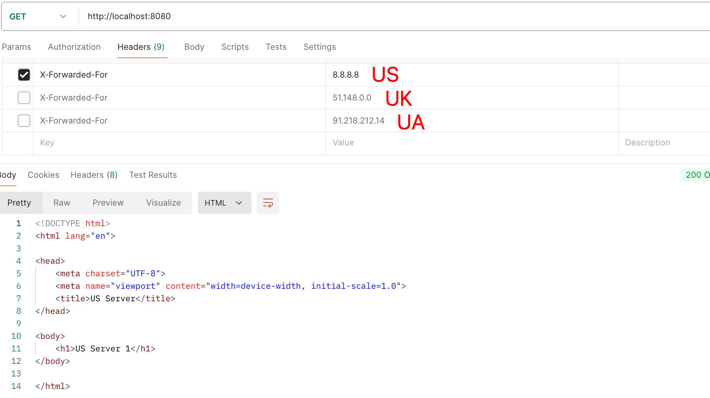
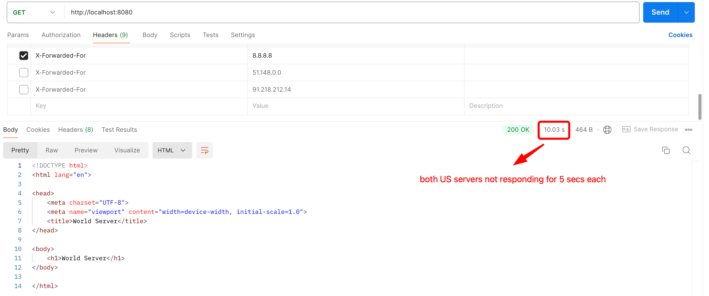

## Nginx Load Balancer

### Testing instructions
- `docker-compose build` so the docker image is loaded properly with all needed features
- `docker-compose up -d` so docker containers start in terminal detached mode
- open Postman and create a `http://localhost:8080` GET request
- add X-Forwarded-For headers for US, UK and UA public IPs (if private IP then will not be recognized by geoip2) in order to simulate requests from different countries and obtain different results according to the location
- make requests with different headers, shooting down containers to see that the backup server is being used in that case

### Demo
US Servers: round robin by default (1st time US server 1, 2nd time US server 2, 3rd time US server 1 and so on...). If all US server are not responding then World server (backup) will obtain the requests.

